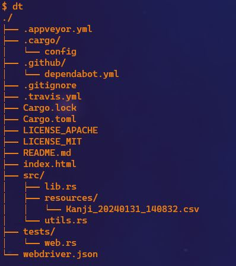

# DirTree for listing directories as a tree

## 

## Installation

```bash
cargo build --release
```

### Add path/link to your target folder

- Path in windows (Command prompt create .bat example)

```bat
@echo off
C:\path\to\your\project\target\release\my_project.exe %*
```

Replace C:\path\to\your\project\target\release\my_project.exe with the actual path to your binary. Then, place this batch file in a directory that's included in your system's PATH environment variable.

- Path in linux (.bashrc alias example)

```bash
alias dt='/path/to/your/project/target/release/my_project'
```

Replace /path/to/your/project/target/release/my_project with the actual path to your binary. After adding this line, you might need to reload your shell configuration by running source ~/.bashrc or source ~/.zshrc, depending on your shell.

## Commands:

- use

```bash
dt
```

- help

```bash
dt -h
```

- exclude

```bash
dt -e target
```
